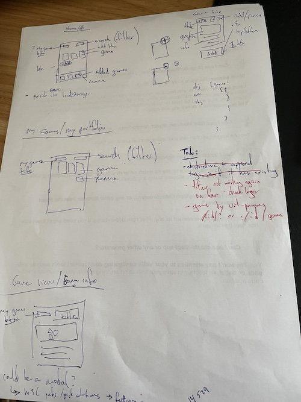

# Games Tiles or Kafka Plants - Adrian Rogers

Display of game tiles (or for plant censor readouts)

## Acknowledgements

- [READMEO.SO](https://readme.so)

## Author

- [@adritek - github](https://www.github.com/adritek)
- [@adrian-rogers LinkedIn](https://www.linkedin.com/in/adrian-rogers/)

## Installation

This project uses Create React App v18.2.0  
Extract the project from the zip
Starting in the Game-tiles folder  
Install App dependancies

```bash
  cd frontend
  npm install
```

Install Server dependancies

```bash
  cd backend
  npm install
```

## Run Locally

Starting in the Game-tiles folder

Start the server

```bash
  cd backend && npm run server
```

In a new terminal window start the app

```bash
  cd frontend && npm start
```

## Running Tests

To run tests, run the following command

```bash
  npm test
  press 'a' to run all tests
```

## 🔗 Links

[](https://github.com/adritek)
[](https://www.linkedin.com/in/adrian-rogers/)

## Screenshots

Before I approach any task, I do a little sketch.


## Lessons Learned

- I would have used concurrently npm package to run the server and the app
- More of a todo - to add data context, add typescript
- TIL screen.debug() is [not encouraged](https://github.com/testing-library/eslint-plugin-testing-library/blob/main/docs/rules/no-debugging-utils.md)
